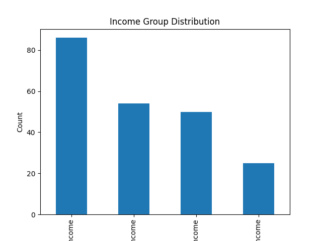
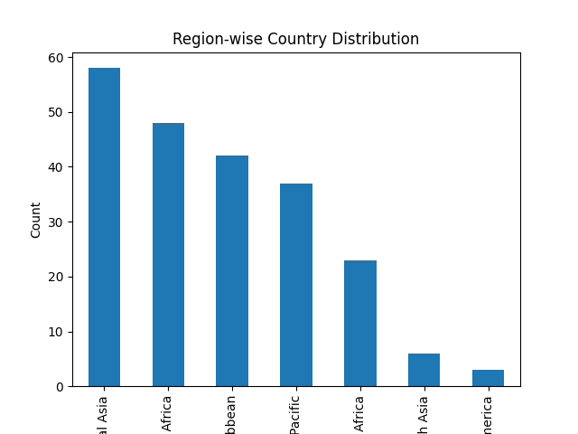
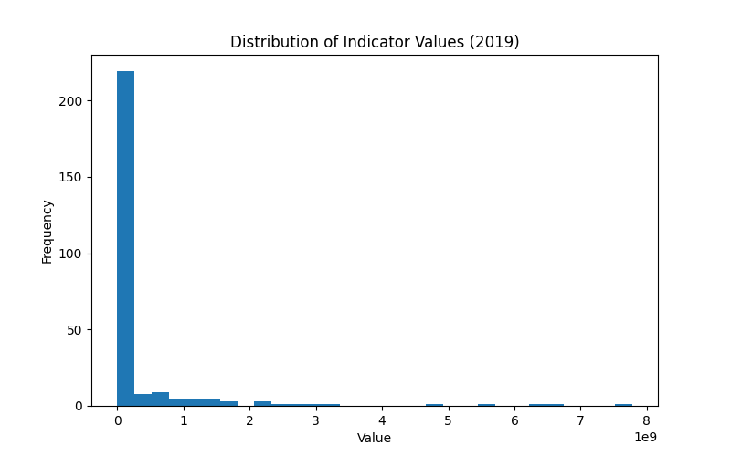

# 📊 PRODIGY_DS_01 - World Bank Data Analysis (Task 1)

## 📌 Project Overview
This project is part of a Data Science internship task.  
It analyzes World Bank datasets to explore global development indicators using Python, Pandas, and Matplotlib.

---

## 📂 Dataset Description

### 1️⃣ Main Dataset (data.csv)
- Country-wise indicators (1960–2025)
- Contains numeric development data

### 2️⃣ Country Dataset (country.csv)
- Country Code
- Region
- Income Group

### 3️⃣ Indicator Dataset (indicator.csv)
- Indicator Code
- Indicator Name

---

## ⚙️ Steps Performed

- Data loading using Pandas
- Data cleaning (handled missing values)
- Merged datasets using Country Code
- Performed Exploratory Data Analysis (EDA)

---

## 📈 Key Visualizations

### Income Group Distribution


### Region Distribution


### Indicator Distribution (2019)


---

## 🛠️ Tools Used
- Python 🐍
- Pandas
- Matplotlib
- Jupyter Notebook (VS Code)

---

## 📌 How to Run

```bash
git clone https://github.com/your-username/PRODIGY_DS_01.git
cd PRODIGY_DS_01
pip install pandas matplotlib
jupyter notebook
